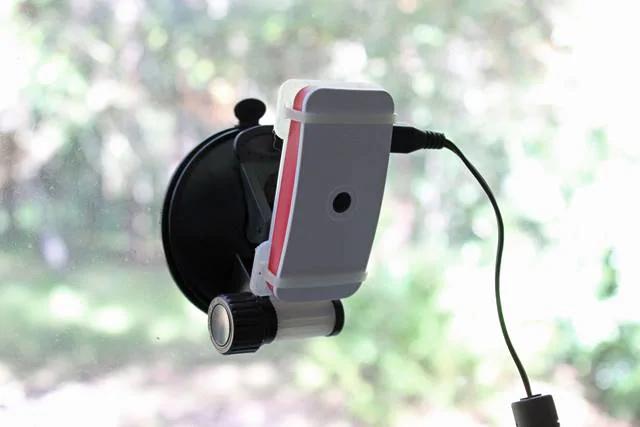
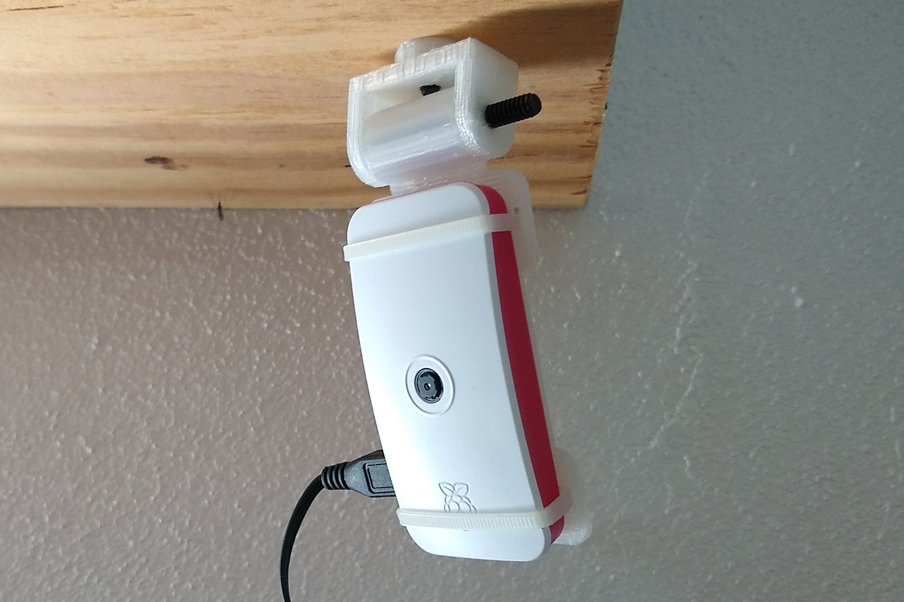

# Pi-Zero-Suction-Cup
Suction Cup Mount for a Pi Zero W and the official Pi Zero case. Great for camera usage.
Top section is used with 10-24 bolts to mount to other things without suction cup.

As seen here: https://www.arrow.com/en/research-and-events/articles/motioneyeos-camera-setup-on-raspberry-pi-zero-w  
Suction cup used: https://amzn.to/2tiJHH9 (Amazon)

*Note Amazon Link is Affiliate
